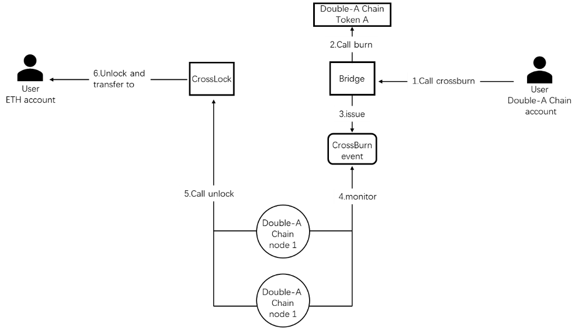

# Bridge

## Introduction
This part introduces the basic information of the Double-A Chain bridge. Double-A Chain will use two EVM-compatible blockchain asset cross-chain solutions, including two types: Native Bridge and Peg Bridge.

## How it works
Double-A Chain will use two EVM-compatible blockchain asset cross-chain solutions, including two types: Native Bridge and Peg Bridge.

## Native Bridge
Native Bridge is a simple asset cross-chain solution. It does not need to convert to intermediate assets, and it can directly map the tokens on Ethereum to Double-A Chain.

### ETH to Double-A Chain


1.	First, use the CrossLock feature on Ethereum.
2.	The contract locks Token A in the contract and then emits a Lock Event. Double-A Chain runs node 1, and Token A's team runs node 2. These two nodes will monitor Lock Events on the Ethereum CrossLock contract.
3.	The Bridge in the picture is a smart contract located on the Double-A Chain. When node1 and node2 find a Lock Event, they will request the crossMint function of the Bridge contract, respectively. crossMint uses openzeppelin's AcessControl for role assignment, and only Crosser can call crossMint.
4.	The contract will assign Roles to node1 and node 2. When node1 and node 2 call crossMint, they vote on this cross-chain behavior. This behavior needs both node1 and node2 to agree to pass.
5.	After the vote is passed, the bridge will call the mint function of the Token A contract. Therefore, the Token A team needs to deploy the contract on the Double-A Chain in advance and allow the Bridge contract to mint or destroy Token A.
6.	If the minting function of Token A is successfully performed, The contract will send token A to the user's address on Double-A Chain.

### Double-A Chain to ETH

1.	User calls the cross burn function of the Bridge contract.
2.	The Bridge contract call the destruction function of the Double-A Chain Token A contract to destroy the user's token.
3.	The Bridge contract emits a CrossBurn event.
4.	Node1 and node 2 are run and controlled by Double-A Chain and Token A teams, who will monitor CrossBurn events. When node1 and node2 find a CrossBurn event, they will call the unlock function of the CrossLock contract on Ethereum.
5.	In the unlock function, the caller's permission needs to be checked. Only node1 and node 2 can call the unlock function. When the unlock function is called, node1 and node2 will vote on this cross-chain behavior. When both node1 and node2 agree, the cross-chain is passed for this time.
6.	After the previous step is completed, Token A locked in the contract is unlocked and transferred to the user.

## What should our partners do?
1.	Contact the Double-A Chain team for more details and request to deploy a smart contract.
2.	Deploy your ARC-20 token on the Double-A Chain, implement the IToken interface, and give the Bridge contract the right to call mint and burn function.
```solidity
// SPDX-License-Identifier: MIT

pragma solidity ^0.7.0;
import "@openzeppelin/contracts/token/ARC20/IARC20.sol";
interface IToken is IARC20{
   function mint(address to, uint amount) external returns(bool);
   function burn(address from, uint amount) external returns(bool);
}
```
3.	Obtain the Smart Bridge Node program from the Double-A Chain team and inform Double-A Chain of the Ethereum account address controlled by the node. Double-A Chain will grant permission to call the unlock function of the CrossLock contract and the crossMint function of the Bridge contract. At the same time, our partners must also provide an address to charge cross-chain fees.
4.	Run the Smart Bridge Node, keep the node online, and ensure that the account controlled by the node has enough ETH and BNB to call the contract.

## Application for token-peg

Steps are：
1. Put in an application to bd@acuteangle.com
2. Deploy your smart contract
3. Test
4. Launch

## Asset-Peg Manual

### Summary
Users can map ETH, BTC, stable coins and other assets to Double-A Chain through the asset cross-chain bridge, which is achieved by locking a certain number of assets on the source chain and generating the corresponding number of Tokens in the Double-A Chain.
The Double-A Chain encourages community developers to provide more decentralized cross-chain solutions.
This document describes the option for project parties to map Tokens from the source chain to Double-A Chain on their own.

The project owner self maintains the total balance of Token on the multi-chain, including Double-A Chain, and endorses the credibility of Token.
The main processes include：
1）Initial Preparation
2）Source Chain -> Double-A Chain
3）Double-A Chain -> Source Chain

### Glossary
Source Chain: The source chain where the Token is located (e.g. Ethereum)
Src_Token: Token on the source chain, possibly a contract, or a native Token
Locked address or contract: the address used to lock the Token
AAC： Token on Double-A Chain
### Initial Preparation
1. Deploy the lock address or contract on the source chain Src_Lock_Addr
2. Deploy Token on Double-A Chain： AAC
3. Deploy a lock address or contract on Double-A Chain Double-A Chain Lock_Addr
   If you need multiple sign contracts, you can refer to [gnosis/MultiSigWallet](https://github.com/gnosis/MultiSigWallet)。
   If you need contracts with mint/to burn, you can refer to [OpenZeppelin/openzeppelin-contracts](https://github.com/OpenZeppelin/openzeppelin-contracts/tree/master/)。
   The project needs to publicize the above information and invite the community to supervise it. The project also needs to monitor the total coins on both chains.
#### Source Chain-> Double-A Chain
1. Source chain locking Src_Token
   Transfer a certain amount of Src_TokentoSrc_Lock_Addr for locking.
2. Release AAC on the Double-A Chain.
   Execute mint operation to give Double-A Chain_Lock_Addr corresponding amount of AAC.

#### Double-A Chain ->Source Chain
1. Release Src_Token on the source chain.
2. operate Src_Lock_Addr to unlock the corresponding volume.
