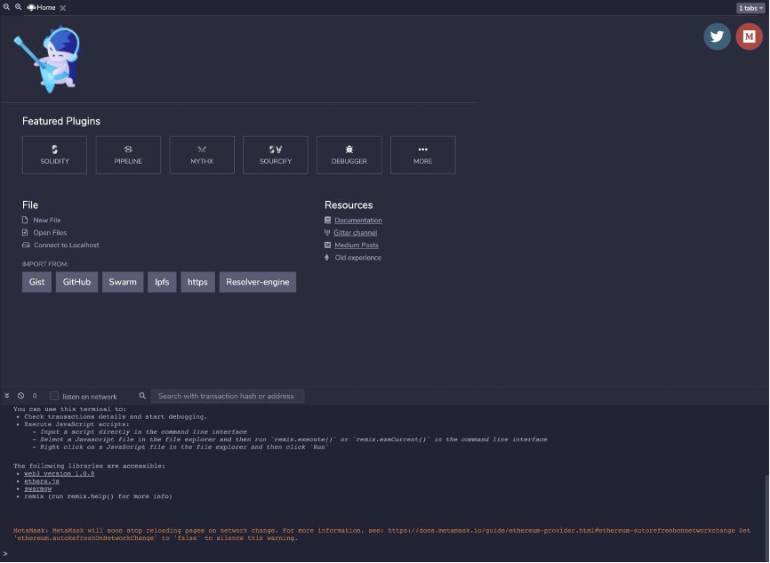
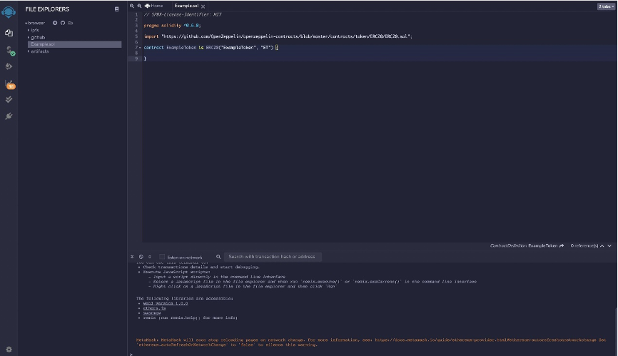
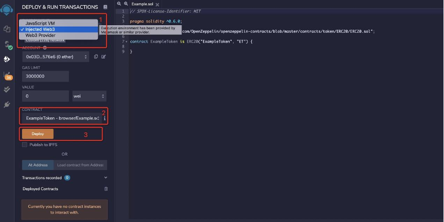

# Developers

## Compile and Run
### Download
Download source code via git
```
git clone https://github.com/double-a-chain-cloud/double-a-chain.git
```

### Install Golang
Reference: [Go Download and install](https://golang.org/doc/install)

### Compile
```shell
cd /path/to/double-a-chain
make geth
```

> If you want to use cross-compile, like compiling on `Mac` for `Linux`, use ` make geth-linux`, `make geth-linux-amd64`, etc.
After compilation is completed, the generated binary is in the folder `build/bin`.

### Run
By running `./build/bin/geth --help`, we can get all option info. Specific usage can refer to Command-line Options

### Deployment
please refer deployment
> SSD is required

### Network
The program will connect to  `mainnet` after it starts. If you want to connect the Testnet, you can add the option `--testnet` to the command when starting.

## Deployment
Configure systemd management settings as follows.

### Hardware
Minimum requirement
```shell
8core
16g
ssd iops>5k
```

Recommended
```
16core
32g
ssd iops>5k
```
Network & Port
```
External IP Address
Port TCP/UDP 32668
```

### Chain Node
- config.toml
```toml
[Eth]
SyncMode = "snap"
TrieCleanCacheRejournal= 300000000000
```

Use snap sync in the config. If full needed, change this line.
The default setting for SyncMode is snap; full is also available if needed.
```toml
SyncMode = "snap"
```
Or
```toml
SyncMode = "full"
```
### Start bash
To show full detail help info of all flags, type geth help or geth -h
- run.sh
```shell
#!/usr/bin/env bash
/data/Double-A Chain/geth-linux-amd64 \
--config /data/Double-A Chain/config.toml  \
--logpath /data/Double-A Chain/logs \&1

```

if you need to use it as archive node, add：
```shell
--syncmode full \
--gcmode archive \ 
```
Then:
```shell
#!/usr/bin/env bash
/data/Double-A Chain/geth-linux-amd64 \ 
```

If no network flags were provided, the node would connect the Double-A Chain-Mainnet by default. If you want to connect to Double-A Chain -Testnet, add:
```shell
--testnet
```

### Systemd Configuration
```
[Unit]
Description=Double-A Chain chain service

[Service]
Type=simple
ExecStart=/bin/sh /data/Double-A Chain/run.sh

Restart=on-failure
RestartSec=5s

LimitNOFILE=65536

[Install]
```


## On-chain Interaction
Double-A Chain is compatible with Ethereum's ecosystem support all Ethereum's RPC  API and DK。

### RPC
[RPC Method List](https://eth.wiki/json-rpc/api)

Example：
```shell
curl -s -H 'content-type:application/json' -d '{"jsonrpc":"2.0","method":"web3_clientVersion","params":[],"id":67}' http://localhost:8545
```

### Developer SDK
Use `Ethereum` SDK library such as `web3j`,`web3js`, etc for development.

#### Get Chain Info
```javascript
const Web3 = require('web3')

async function getChainId() {
const web3 = new Web3('https://http-mainnet.Double-A Chainchain.com')
let chainId = await web3.eth.getChainId()
console.log(`chain id: ${chainId}`)
return chainId
}
```

#### Generate Account
```javascript
const Web3Accounts = require('web3-eth-accounts')

let account = new Web3Accounts().create()
//do not do this on prd env
console.log(`account generated. address: ${account.address}, private key: ${account.privateKey}`)
```

#### Build Transaction
```javascript
const Web3 = require('web3')

async function transfer(fromAccount, to, value){
const web3 = new Web3('https://http-mainnet.Double-A Chainchain.com')
let chainId = await web3.eth.getChainId()
let nonce = await web3.eth.getTransactionCount(fromAccount.address)
let gasPrice = await web3.eth.getGasPrice()

    let unsigned = {
        from: fromAccount.address,
        to,
        value: web3.utils.numberToHex(web3.utils.toWei(value, 'ether')),
        gasPrice,
        nonce,
        chainId,
    }

    unsigned.gas = await web3.eth.estimateGas(unsigned)

    let signed = await fromAccount.signTransaction(unsigned)
    return signed
}
```


## Contract
`Double-A Chain` uses `EVM` for contract execution. See [Solidity](https://docs.soliditylang.org/en/v0.7.1/#) for detail.

### Remix
[Remix IDE](https://remix.ethereum.org/) is an open-source web and desktop application. It fosters a fast development cycle and has rich plugins with intuitive GUIs. The Remix is used for the entire contract development journey and is a playground for learning and teaching.


Create a new file in file explorer. Edit contract info on the right side.



Compile contract
1. Click compiler button, switch UI
2. Select the contract you want to compile
3. Set compile flags
4. Click compile button
   Deploy contract to Double-A Chain via wallet such as MetaMask.




Config network info in `Metamask`


2. Back to `Remix`.
   · Switch environment
   · Select contract
   · click deploy button
   

### Truffle

Use Truffle to compile and deploy the contract.
- Install Node.js See Installing [Node.js](https://nodejs.org/en/download/package-manager/) for detail.
- Install Truffle
```shell
npm install -g truffle
```

Run `truffle version` after installation is finished. If the command line displays a message like below, the installation is successful.
```shell
Truffle v5.1.36 (core: 5.1.36)
Solidity v0.5.16 (solc-js)
Node v10.22.1
Web3.js v1.2.1
```

- Create project
First, create a folder for the project.

```shell
mkdir Example
cd Example
```
Then, initialize the project via Truffle
```shell
truffle init
```
After initialization is complete, the following file structure is generated within the project.
```shell
|-- contracts         //folder for contracts
|-- migrations        //folder for deployment scripts
|-- test              //folder for test scripts
|-- truffle-config.js //truffle config file
```

- Configure info for Truffle
```javascript
const HDWalletProvider = require('@truffle/hdwallet-provider');

const fs = require('fs');
const mnemonic = fs.readFileSync(".secret").toString().trim();

module.exports = {
networks: {
testnet: {
provider: () => new HDWalletProvider(mnemonic, 'https://http-testnet.Double-A Chainchain.com'),
network_id: 256
},
mainnet: {
provider: () => new HDWalletProvider(mnemonic, 'https://http-mainnet.Double-A Chainchain.com'),
network_id: 128
}
},

// Set default mocha options here, use special reporters etc.
mocha: {
// timeout: 100000
},

// Configure your compilers
compilers: {
solc: {
// version: "0.5.1",    // Fetch exact version from solc-bin (default: truffle's version)
// docker: true,        // Use "0.5.1" you've installed locally with docker (default: false)
// settings: {          // See the solidity docs for advice about optimization and evmVersion
//  optimizer: {
//    enabled: false,
//    runs: 200
//  },
//  evmVersion: "byzantium"
// }
},
},
};
```

Create contract put custom contracts into folder `contracts` and modify deployment script in folder `migrations`.
- Deploy the contract.
Run the deployment command.
```shell
truffle migrate --network testnet
```

The output should be as below.
```javascript
2_example_migration.js
======================

Deploying 'ExampleToken'
------------------------
> transaction hash:    0x91e50594a63bc6f4c299f3f445868571678be306b835bddce6dff5c7a5ddf9dc
> Blocks: 2            Seconds: 4
> contract address:    0x54D2049715FC8De1361D7350de90eb05F0f6CA84
> block number:        375304
> block timestamp:     1608016637
> account:             0x03D32B774295D740ffEe43b20fcC0a53acC576e6
> balance:             878.909609236165318643
> gas used:            1056044 (0x101d2c)
> gas price:           20 gwei
> value sent:          0 ETH
> total cost:          0.02112088 ETH


> Saving migration to chain.
> Saving artifacts
   -------------------------------------
> Total cost:          0.02112088 ETH


Summary
=======
> Total deployments:   1
> Final cost:          0.02112088 ETH
Contract deployment completed.
```
Finally, the contract deployment is complete.

## Private Chain

### Private chain construction
Prepare validator account(s)
According to the number of miner nodes, prepare corresponding validator account(s).
You can create a new account by the command `geth account new`, and then put the password to a text file. For example:
```shell
./geth account new --datadir data
echo {your-password} > password.txt
```
After creating an account, you may see the address of the new account.
Or you can also look to the `UTC-**` file under the `data/keystore` path to find it, e.g.
```shell
8cc5a1a0802db41db826c2fcb72423744338dcb0
```

### Genesis.json configuration
//TODO
```json
{
   "config": {
      "chainId": 123,
      "homesteadBlock": 0,
      "eip150Block": 0,
      "eip150Hash": "0x0000000000000000000000000000000000000000000000000000000000000000",
      "eip155Block": 0
   }
}
```

- `congress` Consensus-related parameters
- `period` Block interval time.
- `extraDataUse` to set inital validators. Replace `8cc5a1a0802db41db826c2fcb72423744338dcb0` with your own address. If you want multiple validators, you can replace with stitching them together.
- `alloc` `000000000000000000000000000000000000f000 000000000000000000000000000000000000f001 000000000000000000000000000000000000f002` are system contracts. If you wish to compile it yourself, you can configure `deployedBytecode` field after compilation.

### Create genesis block
After generating the `genesis.json` file, execute the following command to create the genesis block.
```shell
geth init genesis.json
``` 

### Multiple nodes
Use the same `genesis.json` file for initializing the node. Then go to the node command line with the `geth attach` command. View the node information via `admin.nodeInfo`. Then add the node on other machines with `admin.addPeer`,

## Mainnet Info
### Mainnet Info

#### Chain ID
```shell
#TODO
128
```

#### RPC
```shell
#TODO
https://http-mainnet.Double-A Chain.com
wss://ws-mainnet. Double-A Chain.com
```

#### Explorer
```shell
#TODO
https:// Double-A Chain.com
```
#### P2P Nodes
Allow P2P port（default 32668） udp/tcp
> The following nodes are default config for bootstrap node in code [https://github.com/double-a-chain-cloud/double-a-chain/blob/master/params/bootnodes.go](https://github.com/double-a-chain-cloud/double-a-chain/blob/master/params/bootnodes.go)
```
enode://7bed18c87054f807bc9096501bc78f737363f357af831791bab07c4fa6c5a1a67cdcf0a097dc2cc918262ef04fb1c05c26026df5c11a6a56666f9b1fb4072210@18.178.30.66:32668

enode://d67251dd3b050e555679a8abdc427a4c78a9bae174f2fd3b9163c364d27b6a69688ee067cd3214e8ceb71e6e602fd812797b085ae37ed3bf93b78e2b77ae3306@18.181.40.7:32668

enode://f88bb1f5d0e42cf75ec879212b7c8477d605315d5296fba02bc4600eccf73c64427de46567a320d00985d5bc612168817ba6dff169bd6a4774e112e6db0ff6a2@18.176.66.118:32668

```

Put these into static node：：
```shell
[Node.P2P]

StaticNodes = [
"enode://7bed18c87054f807bc9096501bc78f737363f357af831791bab07c4fa6c5a1a67cdcf0a097dc2cc918262ef04fb1c05c26026df5c11a6a56666f9b1fb4072210@18.178.30.66:32668",
"enode://d67251dd3b050e555679a8abdc427a4c78a9bae174f2fd3b9163c364d27b6a69688ee067cd3214e8ceb71e6e602fd812797b085ae37ed3bf93b78e2b77ae3306@18.181.40.7:32668",
"enode://f88bb1f5d0e42cf75ec879212b7c8477d605315d5296fba02bc4600eccf73c64427de46567a320d00985d5bc612168817ba6dff169bd6a4774e112e6db0ff6a2@18.176.66.118:32668"
]
```

## Testnet

### Testnet Info
#### Chain ID
```
# TODO
256
```

#### RPC
```
# TODO
https://http-testnet.acuteangle.com/
wss://ws-testnet.Double-A Chain.com
```

#### Explorer
```
# TODO
https://scan-testnet.Double-A Chain.com
```

#### Faucet
```
# TODO
https://scan-testnet.Double-A Chain.com/faucet
```


## ARC20

### ARC20 standard
Double-A Chain is fully compatible with the [ERC20](https://eips.ethereum.org/EIPS/eip-20) standard, and the interfaces and events are as follows:
```solidity
// ----------------------------------------------------------------------------
// ERC Token Standard #20 Interface
// https://github.com/ethereum/EIPs/blob/master/EIPS/eip-20-token-standard.md
// ----------------------------------------------------------------------------
contract ERC20Interface {
function totalSupply() public constant returns (uint);
function balanceOf(address tokenOwner) public constant returns (uint balance);
function allowance(address tokenOwner, address spender) public constant returns (uint remaining);
function transfer(address to, uint tokens) public returns (bool success);
function approve(address spender, uint tokens) public returns (bool success);
function transferFrom(address from, address to, uint tokens) public returns (bool success);

    event Transfer(address indexed from, address indexed to, uint tokens);
    event Approval(address indexed tokenOwner, address indexed spender, uint tokens);
}
```

EIP Reference：
[eip-20](https://eips.ethereum.org/EIPS/eip-20)
Implementation reference：
[openzeppelin-contracts](https://github.com/OpenZeppelin/openzeppelin-contracts/tree/master/contracts/token/ERC20)


## ARC721

### ARC721 standard
ARC-721 provides functions like transferring tokens from one account to another, getting the current token balance of an account, getting the owner of a specific token, and the total supply of the token available on the network. Besides these, it also has some other functionalities like to approve that an amount of token from an account can be moved by a third party account.
If a Smart Contract implements the following methods and events, it can be called an ARC-721 Non-Fungible Token Contract and, once deployed. It will be responsible for keeping track of the created tokens on Double-A Chain.

#### Methods
```solidity
function balanceOf(address _owner) external view returns (uint256); 
function ownerOf(uint256 _tokenId) external view returns (address); 
function safeTransferFrom(address _from, address _to, uint256 _tokenId, bytes data) external payable; 
function safeTransferFrom(address _from, address _to, uint256 _tokenId) external payable; 
function transferFrom(address _from, address _to, uint256 _tokenId) external payable; 
function approve(address _approved, uint256 _tokenId) external payable; 
function setApprovalForAll(address _operator, bool _approved) external; 
function getApproved(uint256 _tokenId) external view returns (address); 
function isApprovedForAll(address _owner, address _operator) external view returns (bool);
```

#### Events
```solidity
event Transfer(address indexed _from, address indexed _to, uint256 indexed _tokenId);
event Approval(address indexed _owner, address indexed _approved, uint256 indexed _tokenId);
event ApprovalForAll(address indexed _owner, address indexed _operator, bool _approved);
```

#### Web3.py Example
First，make sure you have installed `Web3.py` Python database.
```shell
pip install web3
```

```
  from web3 import Web3
  from web3._utils.events import get_event_data
  
  w3 = Web3(Web3.HTTPProvider("https://cloudflare-eth.com"))
  ck_token_addr = "0x06012c8cf97BEaD5deAe237070F9587f8E7A266d"    # CryptoKitties Contract
  acc_address = "0xb1690C08E213a35Ed9bAb7B318DE14420FB57d8C"      # CryptoKitties Sales Auction
  # This is a simplified Contract Application Binary Interface (ABI) of an ARC-721 NFT Contract.
  # It will expose only the methods: balanceOf(address), name(), ownerOf(tokenId), symbol(), totalSupply()
  simplified_abi = [
  {
      'inputs': [{'internalType': 'address', 'name': 'owner', 'type': 'address'}],
      'name': 'balanceOf',
      'outputs': [{'internalType': 'uint256', 'name': '', 'type': 'uint256'}],
      'payable': False, 'stateMutability': 'view', 'type': 'function', 'constant': True    
  },
  {
      'inputs': [],
      'name': 'name',
      'outputs': [{'internalType': 'string', 'name': '', 'type': 'string'}],
      'stateMutability': 'view', 'type': 'function', 'constant': True
      },
      {
        'inputs': [{'internalType': 'uint256', 'name': 'tokenId', 'type': 'uint256'}],
        'name': 'ownerOf',
        'outputs': [{'internalType': 'address', 'name': '', 'type': 'address'}],
        'payable': False, 'stateMutability': 'view', 'type': 'function', 'constant': True
     },
     {
        'inputs': [],
        'name': 'symbol',
        'outputs': [{'internalType': 'string', 'name': '', 'type': 'string'}],
        'stateMutability': 'view', 'type': 'function', 'constant': True
      },
      {
        'inputs': [],
        'name': 'totalSupply',
        'outputs': [{'internalType': 'uint256', 'name': '', 'type': 'uint256'}],
        'stateMutability': 'view', 'type': 'function', 'constant': True
     },
  ]

    6ck_extra_abi = [
    {
        'inputs': [],
        'name': 'pregnantKitties',
        'outputs': [{'name': '', 'type': 'uint256'}],
        'payable': False, 'stateMutability': 'view', 'type': 'function', 'constant': True
    },
    {
        'inputs': [{'name': '_kittyId', 'type': 'uint256'}],
        'name': 'isPregnant',
        'outputs': [{'name': '', 'type': 'bool'}],
        'payable': False, 'stateMutability': 'view', 'type': 'function', 'constant': True
    }
  ]

  ck_contract = w3.eth.contract(address=w3.toChecksumAddress(ck_token_addr), abi=simplified_abi+ck_extra_abi)
  name = ck_contract.functions.name().call()
  symbol = ck_contract.functions.symbol().call()
  kitties_auctions = ck_contract.functions.balanceOf(acc_address).call()
  print(f"{name} [{symbol}] NFTs in Auctions: {kitties_auctions}")

  pregnant_kitties = ck_contract.functions.pregnantKitties().call()
  print(f"{name} [{symbol}] NFTs Pregnants: {pregnant_kitties}")

  # Using the Transfer Event ABI to get info about transferred Kitties.
    tx_event_abi = {
    'anonymous': False,
    'inputs': [
        {'indexed': False, 'name': 'from', 'type': 'address'},
        {'indexed': False, 'name': 'to', 'type': 'address'},
        {'indexed': False, 'name': 'tokenId', 'type': 'uint256'}],
        'name': 'Transfer',
        'type': 'event'
    }

   # We need the event's signature to filter the logs
   event_signature = w3.sha3(text="Transfer(address,address,uint256)").hex()
   
   logs = w3.eth.getLogs({
      "fromBlock": w3.eth.blockNumber - 120,
      "address": w3.toChecksumAddress(ck_token_addr),
      "topics": [event_signature]
      })
      
   # Notes:
   #   - 120 blocks is the max range for CloudFlare Provider
   #   - If you didn't find any Transfer event you can also try to get a tokenId at:
   #       https://etherscan.io/address/0x06012c8cf97BEaD5deAe237070F9587f8E7A266d#events
   #       Click to expand the event's logs and copy its "tokenId" argument

   recent_tx = [get_event_data(w3.codec, tx_event_abi, log)["args"] for log in logs]

   kitty_id = recent_tx[0]['tokenId'] # Paste the "tokenId" here from the link above
   is_pregnant = ck_contract.functions.isPregnant(kitty_id).call()
   print(f"{name} [{symbol}] NFTs {kitty_id} is pregnant: {is_pregnant}")
```

## Gas fee

Gas price suggestions based on txpool
3 levels： slow, medium, fast；
```shell
curl https://tc. www.acuteangle.com//price/prediction
```
```shell
{
  "code": 0,
  "prices": {
    "fast": 29,
    "median": 1,
    "low": 1
  }
}
```

## Txpool

To expedite pending transactions.
### 1）Inadequate nonce：
- Try to reset to an appropriate value
- If there are multiple pending transactions, please wait for earlier transactions to confirm first.
- Metatask--setting-advanced--reset account
- Metatask--setting--advanced--Customize transaction nonce: resend transaction with pending tx's nonce and higher gas price.
### 2）Low gas fee：
- Set to a higher gas fee and resend


## Common Issues

## Delay on Metamask
Slow response when inputting transfer amount, fetching gas price, etc. It is a chrome's known issue according to the following issue：[https://github.com/MetaMask/metamask-extension/issues/10202](https://github.com/MetaMask/metamask-extension/issues/10202)
To resolve this issue：
1）Use Expand view
2）Move the window to primary monitor if using multiple monitors
3）Use other explorers
