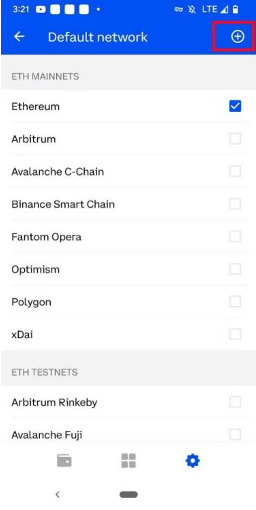

# Wallet
## Supported Wallets：
Double-A Chain supports all wallets with custom networks feather such as Metamask, imToken, TokenPocket, and Coinbase Wallet.
Please use the link information below：
### mainnet
```
// TODO
chainid: 572845
rpc: http://3.129.253.183:10212
scan: http://18.188.173.250
```
### testnet 
```
// TODO
Chainid: 256
Rpc: https://http-testnet.acuteangle.com
Scan: https://testnet.Double-A Chain.com
```

## Metamask
[download url：https://metamask.io/](https://metamask.io/)
1. Step 1：
Click the menu button


2. Step 2：
Click"Settings" 


4. Step 3：
Click"Networks"


5. Step 4：
Add network


6. Step 5：
Fill in Double-A Chain's network information


## imToken
1. Step 1：
Open network switch by clicking on Ethereum Mainnet


2. Step 2：
Click the 'setting' button in the network switch section


3. Step 3：
Click the add button in ETHEREUM Node Settings


4. Step 4：
Click customize


5. Step 5：
Fill in Double-A Chain's network information


## TokenPocket
1. Step 1：
Click the wallet icon


2. Step 2：
Scroll down the list and click the Add custom network button


3. Step 3：
Fill in Double-A Chain's network information


## Coinbase Wallet
1. Step 1：
Click"Default network" in Settings.


2. Step 2：
Click the add button.



3. Step 3：
Fill in Double-A Chain's network information.


